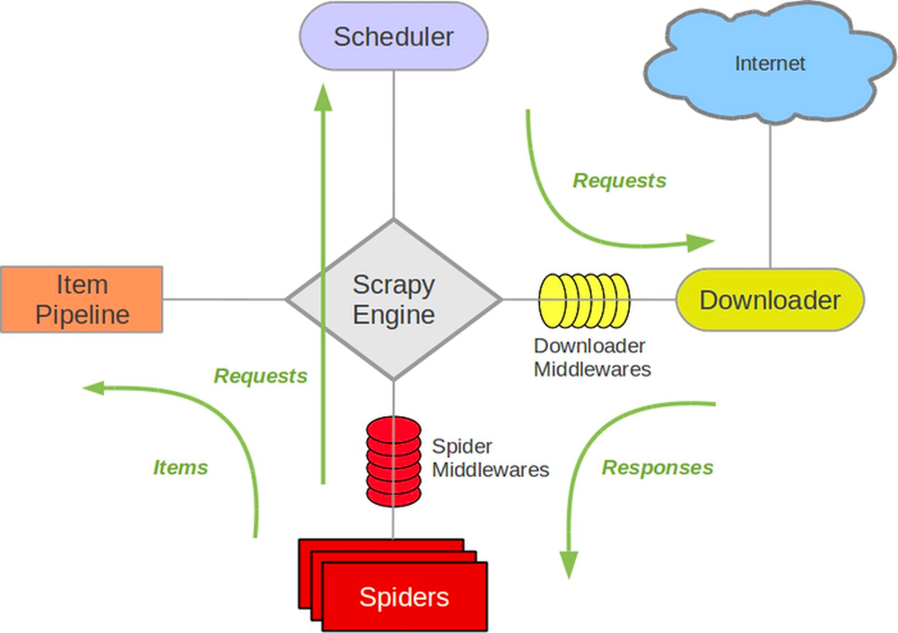

项目说明
---

项目框架:
1. 爬虫框架: scrapy

Scrapy 是一个快速的高级网页抓取框架，用于抓取网站并从其页面中提取结构化数据。它可用于广泛的用途，从数据挖掘到监控和自动化测试。
Scrapy主要的组件有引擎、调度器、下载器、爬虫、实体管道、爬虫中间件和下载器中间件。
如下图绿色箭头代表着数据流，各个模块的功能可简要概括如下：

1.Scrapy引擎(Scrapy Engine)：控制数据流在所有组件中的流动，一般不需要修改

2.调度器(Scheduler)：从引擎接受请求并将他们加入爬虫队列，一般不需要修改

3.下载器(Downloader)：负责获取网页并提供给引擎，类似request获取网页，一般不需要修改

4.爬虫(Spider)：负责解析网页，提取数据，类似解析网页，根据爬取的对象修改代码

5.实体管道(Item Pipline)：负责存储数据，根据数据存储方式修改代码


2. 数据存储: mongodb


一.环境安装
```
# 安装scrapy爬虫框架
pip install scrapy

# 安装monogodb数据库组件
pip install pymongo
```

二.项目搭建
1. cmd中创建scrapy项目:
   1. 创建项目目录: 
```
mkdir -p python_workspace/daomunovel
```
   2. 创建scrapy项目语法: scrapy startproject [项目名称]
```commandline
scrapy startproject daomunovel
```

2.进入到daomu项目: 
 ```
 cd daomunovel
 ```

三. 项目编写
1. 创建爬虫
   1. 在daomunovel中创建爬虫文件语法: scrapy genspider example example.com (#example：表示的是爬虫的项目名称 | #example.com：表示的是初始化域名)
```
scrapy genspider daomu www.daomubiji.com
```

2.定义item
    1.使用PyCharm或者Visual Studio Code打开项目. 在items.py文件中定义数据内容:
        1.书名: book_title
        2.章节名: chapter_name
        3.文本内容: content_text
```
import scrapy
class DaomunovelItem(scrapy.Item):
    # define the fields for your item here like:
    # name = scrapy.Field()

    # 书名
    book_title = scrapy.Field()
    # 章节名称
    chapter_name = scrapy.Field()
    # 文本内容
    content_text = scrapy.Field()
    pass
```

3. 编写爬虫文件(spiders)

```
import scrapy
from domu.items import DomuItem
from copy import deepcopy
import os
import re
 
class ExampleSpider(scrapy.Spider):
    name = 'example'
    allowed_domains = ['daomubiji.com']
    start_urls = ['http://www.daomubiji.com/']
 
    def parse(self, response):
        #开始解析网页第一层，拿到书的名称
        res = response.xpath('//ul[@class="sub-menu"]/li')
 
        for i in res:
            item = DomuItem()
            #书的名称
            item['book_title'] = i.xpath('.//a/text()').get()
            #拿到书连接，可以进入拿到书的章节
            url_one = i.xpath('.//a/@href').get()
 
           # 存放路径
            book_path = re.sub(r'[\\\/\:\*\?\"\<\>\|]','_',item['book_title'])
 
            dirpath = './novel/{}'.format(book_path)
 
            # 创建
            if not os.path.exists(dirpath):
                os.makedirs(dirpath)
 
            yield scrapy.Request(url_one,callback=self.parse_two,meta={'item':    
            deepcopy(item)})
 
    def parse_two(self, response):
        #开始解析网页第二层，拿到书的章节
        #把刚刚传参的参数取下来
        item = response.meta.get('item')
 
        res_two = response.xpath('//div[@class="excerpts"]/article')
        for i in res_two:
            #书的章节
            item['chapter_name'] = i.xpath('.//a/text()').get()
            #拿到章节连接，可以进入拿到文本内容
            url_two = i.xpath('.//a/@href').get()
            
            yield scrapy.Request(url_two,callback=self.parse_three,meta={'item': 
            deepcopy(item)})
 
    def parse_three(self, response):
        #开始解析网页第三层，拿到文本内容
        #把刚刚传参的参数取下来
        item = response.meta.get('item')  
 
        res_three=response.xpath('//article[@class="articlecontent"]/p/text()').getall()
 
        item['content_text'] = '\n'.join(res_three)
 
        yield item
 
```

4. 定义pipelines.py
```
from itemadapter import ItemAdapter
import re
 
class DomuPipeline:
    def process_item(self, item, spider):
        filename = './novel/{}/{}.txt'.format(
            re.sub(r'[\\\/\:\*\?\"\<\>\|]', '_', item['book_title']),
            re.sub(r'[\\\/\:\*\?\"\<\>\|]', '_', item['chapter_name']),
        )
        print('正在写入')
 
        with open(filename,'w',encoding='utf-8') as f:
            f.write(item['content_text'])
 
        return item

```
    
5. 开启piplines(settings.py)

```
ITEM_PIPELINES = {
    'domu.pipelines.DomuPipeline': 300,
}
```
    
6. 定义启动文档并运行项目(创建run.py)
```commandline
from scrapy import cmdline
cmdline.execute('scrapy crawl daomu'.split())
```

7. touch run.py
```commandline
from scrapy import cmdline
# 表示爬虫文件daomu.py中的name
cmdline.execute('scrapy crawl daomu'.split()) 
```

8. 启动本地mongodb服务
```
mongod --dbpath /usr/local/var/mongodb --logpath /usr/local/var/log/mongodb/mongo.log --fork
```

9. settings.py配置mongodb数据库
```commandline
# 定义mongodb
MONGODB_HOST = 'localhost'
MONGODB_PORT = 27017
# 定义数据库名称
MONGODB_NAME = 'spider'
# 定义集合名称
MONGODB_DOCNAME = 'daomubiji'
```
10.piplines.py中新增存储逻辑
```commandline
        host = spider.settings['MONGODB_HOST']
        port = spider.settings['MONGODB_PORT']
        db_name = spider.settings['MONGODB_NAME']
        client = pymongo.MongoClient(host=host, port=port)
        db = client[db_name]
        collection = db[spider.settings['MONGODB_DOCNAME']]
        collection.insert_one(dict(item))
```


